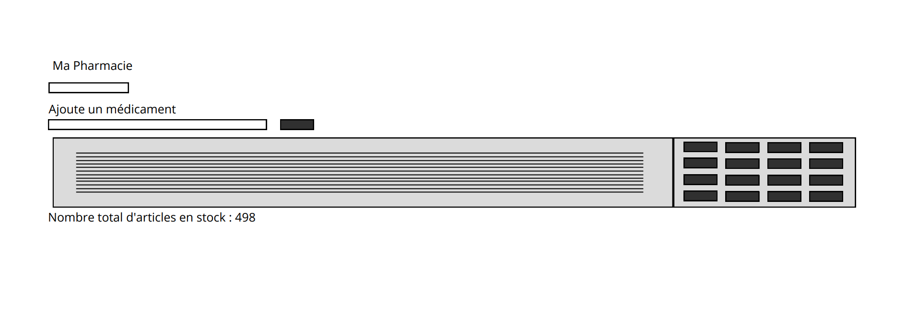
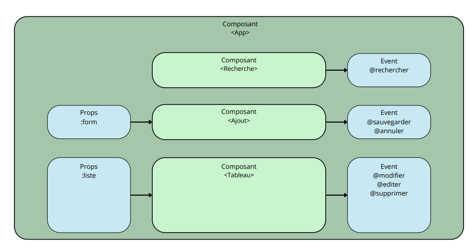

# Gestionnaire de Pharmacie

Une application simple en Vue.js pour gérer un stock de médicaments.

## Fonctionnalités

- **Affichage du stock** : Liste complète des médicaments avec leurs informations.
- **Affichage des images** : Visualisation des photos des médicaments (si disponibles).
- **Gestion des quantités** : Augmentation ou diminution rapide du stock (+1 / -1).
- **Ajout et Modification** : Formulaire pour ajouter de nouveaux produits ou modifier les existants.
- **Suppression** : Possibilité de retirer un médicament du stock avec confirmation.
- **Recherche Avancée** : Filtrage par nom, forme pharmaceutique et quantité maximum.
- **Statistiques** : Calcul automatique du nombre total d'unités en stock.

## Installation et Lancement

1. Assurez-vous d'avoir [Node.js](https://nodejs.org/) installé.
2. Dans le dossier `Projet_Pharmacie`, installez les dépendances :
   ```bash
   npm install
   ```
3. Lancez le serveur de développement :
   ```bash
   npm run dev
   ```
4. Ouvrez l'adresse indiquée dans votre navigateur (généralement `http://localhost:5173`).

## Structure du Projet

- `src/App.vue` : Composant principal gérant l'état global.
- `src/components/` : Composants réutilisables (Tableau, Recherche, Ajout).
- `src/services/` : Logique de communication avec l'API.
- `src/Medicament.js` : Modèle de données pour un médicament.

## Le site

- **Lien du site** : https://projet-pharmacie-7521.vercel.app/
- **Lien backup (on sait jamais)** : https://sage-lollipop-7ae433.netlify.app/

## Graphes 


